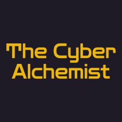

  

<h1 align="center">Hello, World! 👋 I’m Sourav Sadhukhan</h1>
<h3 align="center">Senior Frontend Engineer compiling pixel-perfect UIs and squashing bugs in production.</h3>

  

  <em>Powered by cold coffee, fueled by momos, and currently executing builds on a Mac Mini M4.</em>

  

## 👨‍💻 `<About Me />`

  <strong>Query Me About:</strong> React Native, React, JavaScript, Typescript, Architecture  
  <strong>POST /contact:</strong> <a href="mailto:ssadhukhan990@gmail.com">ssadhukhan990@gmail.com</a>

  

## 🛠️ `package.json` (Tech Stack)

### ⚙️ Core Dependencies
        

### 🖥️ Frontend & UI
        

### 📱 Mobile & Native
    

### 🏗️ Architecture & Data
    

### 🤖 AI-Assisted Development
   

### 🛠️ DevOps & Tools
       

  

## 📚 `README.md` (Technical Insights)

  <strong>Pushing commits and insights</strong> on LinkedIn, sharing deep dives into web/mobile development, React Native, and modern JavaScript patterns.

  

  

## 🚀 `CI/CD Pipeline` (Experience)

<b>💼 Senior Frontend Engineer @ PwC India (Kolkata, India)</b> — <i>Jul 2025 – Present</i>

 

- Primary Technical Decision Maker on a US retail logistics portal serving web and mobile users with 3 role-based personas.
- Leading a mixed frontend team of 5 developers, guiding architecture, code standards, and approach across the shared React + React Native codebase.
- Architected the codebase skeleton — route configuration, folder structure, naming conventions, and component patterns.
- Translated Figma designs into pixel-perfect, responsive screens across iOS, Android, and Web.
- Built and maintained reusable UI components using an internal component library + Storybook.
- Resolved multiple high-severity security vulnerabilities flagged by GitHub Advanced Security and SonarQube.
- Final approver for production PRs — managing all releases including feature flag rollouts.
- Coordinated daily with an external backend API vendor and onsite product owner to align API contracts.
- Implemented offline-first data handling using IndexedDB and sync queue strategies.
- Drove weekend crunch execution to meet critical client deadlines and resolved QA-raised bugs.

<b>📱 Senior Mobile Application Developer @ Fareportal (Remote)</b> — <i>Apr 2023 – Jun 2025</i>

 

- Owned App Store & Play Store release management end-to-end.
- Built a custom OTA update mechanism (CodePush-style), cutting bug-fix adoption time from 5 days → 24 hours.
- Led React Native upgrade 0.71 → 0.78, adopting Fabric architecture, Turbo Modules, and Hermes engine.
- Monitored app stability via Firebase Crashlytics & Analytics, raising crash-free sessions to 99.2%.
- Implemented offline-first data persistence using AsyncStorage.
- Integrated OneTrust and Osano consent SDKs for GDPR & CCPA compliance.
- Developed native modules in Objective-C and Java to access device-level APIs.
- Contributed to a modular micro-frontend architecture.

<b>📱 Mobile Application Developer @ Fareportal (Remote)</b> — <i>Nov 2021 – Mar 2023</i>

 

- Upgraded React Native 0.64 → 0.71, resolving major library incompatibilities.
- Integrated Apple Pay and Venmo payment methods.
- Implemented Google Play In-App Updates.
- Added in-app rating prompts, increasing daily rating submissions by 4×.
- Developed reusable UI components and Lottie animations.
- Maintained Express.js REST APIs for app promotions.

<b>🖥️ System Engineer @ Tata Consultancy Services (Kolkata, India)</b> — <i>Jul 2020 – Oct 2021</i>

 

- Delivered features for React Native and React web applications.
- Built 3 internal inventory management apps, improving operational efficiency by ~40%.
- Packaged Redux state management into a reusable internal package.
- Acted as SPOC for production issues, leading a team of 5 to resolve live incidents.

<b>💻 Assistant System Engineer @ Tata Consultancy Services</b> — <i>Jul 2019 – Jun 2020</i>

 

- Published React Native e-commerce apps reaching 1M+ total downloads.
- Optimized Node.js backend using PM2 clustering and log rotation.
- Set up proactive failure alerts to cut incident response time.

  

## 🏆 `exit 0` (Honors & Accolades)

- 🏅 **Employee of the Year Award** (Fareportal) - Q4 2024
- 🏅 **Ownership and Accountability Award** (Fareportal) - Q1 2024
- 🏅 **Fast Execution Awards** (Fareportal) - Q2 2023 & Q2 2022
- 🏅 **Passion For Customers Award** (Fareportal) - Q4 2021
- 🏅 **Technical Excellence Award** (TCS) - June 2020
- 🏅 **Technical Finesse Award** (Narula Institute of Technology) - 2019

  

## 📜 `Verified_Tokens` (Certifications)

- **Prompt Engineering for ChatGPT** Vanderbilt University - Coursera (Sep 2023)

  

## 🎓 `git init` (Education)

### Bachelor of Technology
**Narula Institute of Technology** | *2015-2019* 📚 Stream: Electronics & Communication Engineering

### Higher Secondary Education  
**Shibpur Dinobandhu Institution (Branch)** | *2013-2015* 📚 Stream: Computer Science

### Secondary Education  
**Shibpur Dinobandhu Institution (Branch)** | *2013* 🚀 Initiated Tech Journey: Basic computer literacy & logical thinking

  

## 📄 `Artifacts` (Documents)

  

## 🔗 `/api/v1/connect` (Links)

  

## 📊 `Telemetry_Data` (GitHub Stats)

  
  

 

  

 

  

  

  <em>Refactored with passion, sarcasm, and zero console warnings.</em>

